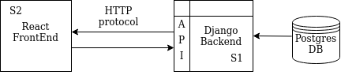
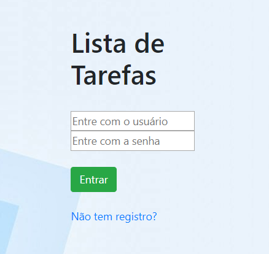
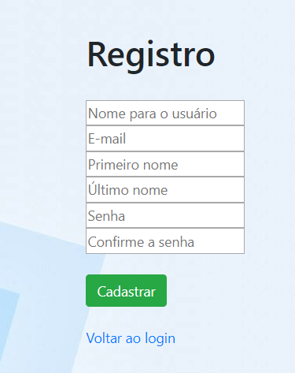
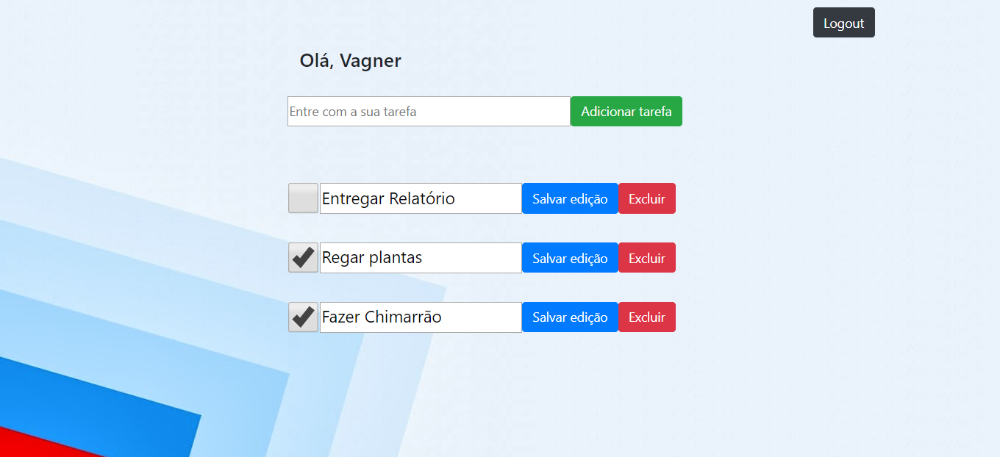

# O.S. Systems

A O.S. Systems foi fundada em 2002, devido à carência no mercado de empresas aptas a executar personalização de sistemas operacionais e prestar consultoria especializada em software de código aberto. Desde então, estamos engajados em vários projetos globais e com times de desenvolvimento ao redor do mundo.

## Teste de Fullstack

O objetivo deste desafio é avaliar o domínio do candidato no desenvolvimento fullstack. Será avaliado boas práticas de code style, organização do projeto, criação de APIs, conhecimento de frameworks e tecnologias.

## Instruções para o desafio

* Fork esse repositório e faça o desafio numa branch com o seu nome (exemplo: nome-sobrenome)
* Assim que concluir o seu desafio, abra um pull request com suas alterações.

## Desafio

O desafio consiste em um to do list com suporte a multiplos usuários.

O projeto deve ter três páginas:

1. Login
2. Signup
3. Lista de to-dos

A página de listagem dos to-dos deve permitir a inserção de novos itens, edição inline do item, remoção e alteração do seu status.

**ATENÇÃO:** Já que o sistema deve suportar multiplos usuários não esqueça de vincular no banco de dados cada item de to-do ao usuário logado no sistema.

Uma idéia de interface do sistema:

<p align="center">

</p>

E sim, essa é uma screenshot do todomvc e você pode se inspirar nela, sem copiar o código. Caso você faça nós saberemos e você será desclassificado :)

## Escopo do desafio

* Desenvolver os módulos de frontend e backend de forma separada
* O desenvolvimento do backend deve ser feito em Node.js ou Golang
* O desenvolvimento do frontend deve ser feito com React ou Vue.js
* O banco de dados você pode escolher entre um destes: PostgreSQL, MySQL, MongoDB ou SQlite (não esqueça que o backend deve criar a estrutura inicial do banco automaticamente)
* Não é necessário submeter uma aplicação que cumpra cada um dos requisitos descritos, mas o que for submetido deve funcionar

## O que será avaliado

* O código será avaliado seguindo os seguintes critérios: manutenabilidade, clareza e limpeza de código; resultado funcional; entre outros fatores
* O histórico no git também está avaliado
* Não esqueça de documentar o processo necessário para rodar a aplicação
* Se necessário explique as decisões técnicas tomadas, as escolhas por bibliotecas e ferrramentas, o uso de patterns etc

## Diferenciais

* Adaptar a página para dispositivos móveis
* Dockerizar de forma separada o backend e o frontend
* Utilização de boas práticas de UX na solução
* Boa documentação de código e de serviços
* Testes do código
=======


# Todo List

## Descrição

Este projeto foi desenvolvido como desafio proposto pela O.S. Systems referente a vaga de ingresso, ele consiste em uma aplicação Web de lista de tarefas utilizando Django no Backend e React no Frontend.
Foi criada uma API REST que disponibilizou os dados em formato JSON para consumo no Front via autenticação de usuário por Token através dos métodos HTTP. 




## Interface Web

O projeto é basicamente composta de 3 views, com as funções de login, signup e tarefas que acabam correspondendo com as terminações da url  a partir do localhost. 

todoList.PNG
  

## Instalação

A instalação descrita se dá em ambiente Linux, com S.O. Ubuntu preferencialmente.

### Instalação do Postgres e criação do banco

O seguinte site dispõe de uma boa fonte para instalação do postgres em ambiente linux, utilizei este guia para fazer a configuração de usuário e criação do banco de dados via psql pelo terminal.

 
[https://tecadmin.net/install-postgresql-server-on-ubuntu/](https://tecadmin.net/install-postgresql-server-on-ubuntu/)

  Cabe ressalatar que dentro do postgres é insteressante configurar um password para o usuário vinculado.

Se quiser sair do usuário postgres entre:

```exit```

> Importante: Depois de configurar e instalar o banco é necessário ir no arquivo backend/projeto/settings.py e mudar as credenciais do banco de acordo com o nome do banco criado e as configurações adotas..


### Configuração do ambiente virtual 
Em uma pasta separada crie um ambiente virtual com o nome que quiser (todo_env no exemplo abaixo) em uma pasta de ambientes virtuais com python3 pelo seguinte comando:
```python3 -m venv todo_env```

Se quiser, configure um alias para ativação do seu terminal no arquivo home para que não tenha que recorrer toda vez que ativar seu ambiente virtual de python:
1. entre no arquivo .bashrc na pasta home
2. adicione a seguinte linha no final do arquivo e salve:
```alias todo="source ~/virtualenvs/todo_env/bin/activate"```

Agora quando for utilizar o ambiente virtual basta entrar com o comando:
	```todo```

Lembrando que para sair do ambiente virtual basta utilizar o comando:
```deactivate```

### **Baixando as dependencias na virtualenv**

Na pasta backend do projeto existe um arquivo chamado requirements.txt, nele estão contidos as dependências necessárias. Proceda da seguinte forma:

1.Entre na sua virtualenv:
```todo```
2. Instale as dependências dentro da pasta backend:
```pip install --upgrade -r requirements.txt```


### ****Rodando o servidor local da aplicação backend****
Na pasta backend execute o comando a seguir que fará com que o banco se estruture com o modelo criado:

```python manage.py migrate```

E deixe rodar o servidor de backend no terminal:

```python manage.py runserver```

### **Instalação do Node e das dependências do React** (FrontEnd)

Vá para pasta home e baixe o executável node pelo seguintes comandos:
1. ```cd ~```
3. ```curl -sL https://deb.nodesource.com/setup_10.x -o nodesource_setup.sh```

4. Rode o executável:
```sudo bash nodesource_setup.sh```
A versão do node pode ser verificada pelo comando:
```node -v```

5. Volte agora para a pasta do projeto e vá para a pasta frontend. Neste diretório com o comando ls podemos ver o arquivo packages.json, onde estão as dependências utilizadas, execute o seguinte comando:
```npm install```

6. Agora basta começar o servidor estático com o seguinte comando :
```npm start```


## Referências
Segue abaixo algumas referências utilizadas no desenvolvimento do projeto:

[1] Pull request and forking

[https://www.youtube.com/watch?v=_NrSWLQsDL4](https://www.youtube.com/watch?v=_NrSWLQsDL4)

 

  

[2].Lista de tarefas com Django com MTV

[https://code.tutsplus.com/articles/intro-to-django-building-a-to-do-list--net-2871](https://code.tutsplus.com/articles/intro-to-django-building-a-to-do-list--net-2871)

  

  

[3].Usando post method

[https://medium.com/fbdevclagos/how-to-build-a-todo-app-with-django-17afdc4a8f8c](https://medium.com/fbdevclagos/how-to-build-a-todo-app-with-django-17afdc4a8f8c)

  

  

[4].Aplicação por forms

[https://www.geeksforgeeks.org/python-todo-webapp-using-django/](https://www.geeksforgeeks.org/python-todo-webapp-using-django/)

  

  

[5].Django API(14:03)

[https://medium.com/@BennettGarner/build-your-first-rest-api-with-django-rest-framework-e394e39a482c](https://medium.com/@BennettGarner/build-your-first-rest-api-with-django-rest-framework-e394e39a482c)

  

  

[6.]Serializador

[https://www.django-rest-framework.org/tutorial/quickstart/](https://www.django-rest-framework.org/tutorial/quickstart/)

  

  

[7].Big model – many tables example

[https://books.agiliq.com/projects/django-api-polls-tutorial/en/latest/setup-models-admin.html#creating-a-project](https://books.agiliq.com/projects/django-api-polls-tutorial/en/latest/setup-models-admin.html#creating-a-project)

  

[8]Admin stuff model for user using rest

[https://medium.com/@apogiatzis/create-a-restful-api-with-users-and-jwt-authentication-using-django-1-11-drf-part-1-288268602bb7](https://medium.com/@apogiatzis/create-a-restful-api-with-users-and-jwt-authentication-using-django-1-11-drf-part-1-288268602bb7)

  

  

[9] Beautiful bootstrap version

[https://www.youtube.com/watch?v=8QBYrKhqgFI](https://www.youtube.com/watch?v=8QBYrKhqgFI)

  

  

[10] Criação de aplicações React
 [https://www.digitalocean.com/community/tutorials/how-to-build-a-react-to-do-app-with-react-hooks](https://www.digitalocean.com/community/tutorials/how-to-build-a-react-to-do-app-with-react-hooks) 

  

  

[11]All-in-one:[
https://scotch.io/tutorials/build-a-to-do-application-using-django-and-react](https://scotch.io/tutorials/build-a-to-do-application-using-django-and-react)

  

[12]Sign up Django:
[https://simpleisbetterthancomplex.com/tutorial/2017/02/18/how-to-create-user-sign-up-view.html](https://simpleisbetterthancomplex.com/tutorial/2017/02/18/how-to-create-user-sign-up-view.html)

  

[13] Instalação do React

[https://www.zeolearn.com/magazine/setup-react-ubuntu](https://www.zeolearn.com/magazine/setup-react-ubuntu)

  

[14] Configuração Postgres-Django:

[https://www.digitalocean.com/community/tutorials/how-to-use-postgresql-with-your-django-application-on-ubuntu-14-04](https://www.digitalocean.com/community/tutorials/how-to-use-postgresql-with-your-django-application-on-ubuntu-14-04)

  

[15] Configuração do React no Ubuntu

[https://www.zeolearn.com/magazine/setup-react-ubuntu](https://www.zeolearn.com/magazine/setup-react-ubuntu)

  

[16]Aula 3 – Semana Omnistack:

[https://www.youtube.com/watch?v=jFl90T6lnBQ](https://www.youtube.com/watch?v=jFl90T6lnBQ)


